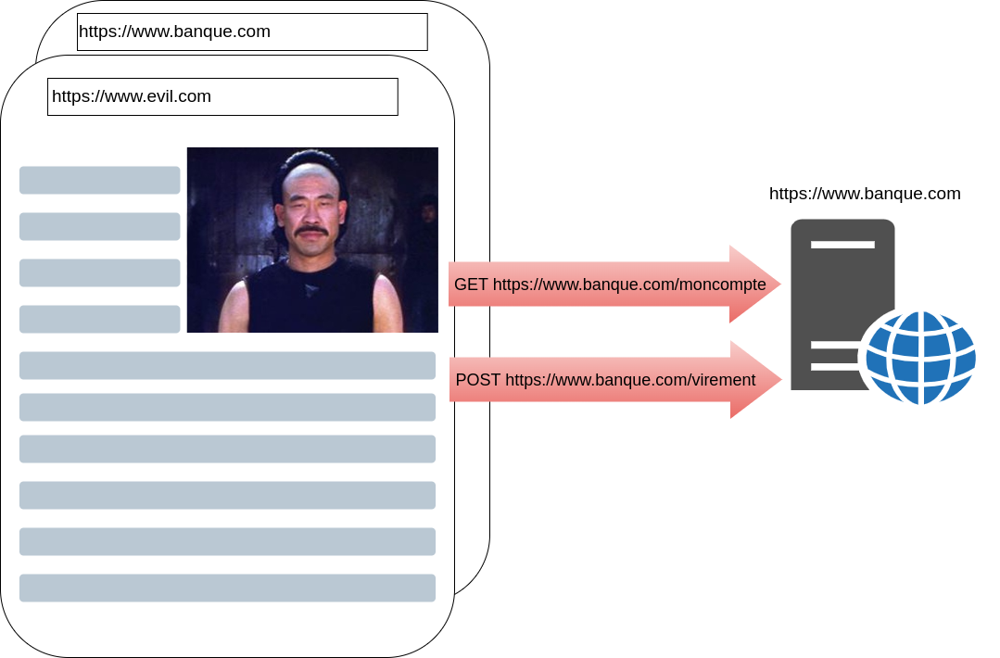
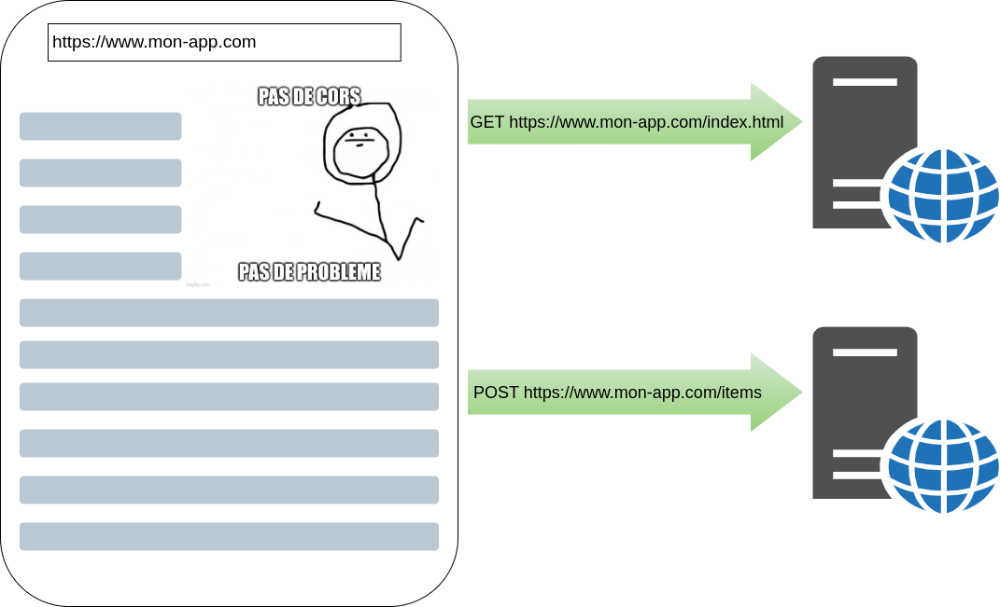
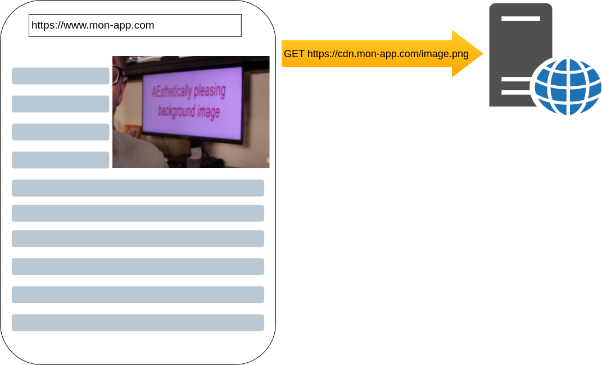
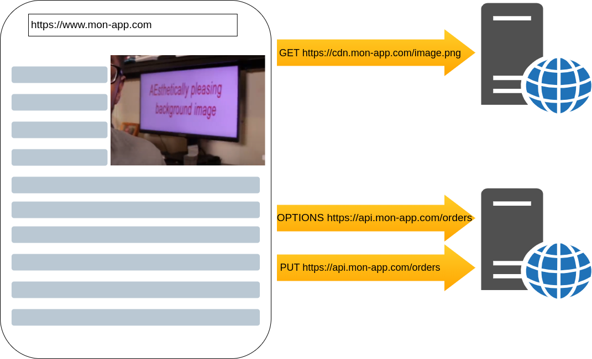

[.columns]
= Qui suis-je ?

// image de moi
[.column.is-half.profile]
image::pictures/moi.png[]

[.column.has-text-left]
--

Tech Lead/Archi technique
--

[NOTE.speaker]
--
Dev backend, mise en place infra
travail avec dev front

--

== Les erreurs CORS ?

image::pictures/pacellela2.jpg[width=50%]]

[NOTE.speaker]
--
Pas celles là

--

[.trigger-anim]
== !

[.screen-cors.screenshot]
image::pictures/cellela.png[width=130%]

[%step]
[.screen-cors.screen-anim.anim1]
image::pictures/cellela.png[width=20%]
[%step]
[.screen-cors.screen-anim.anim2]
image::pictures/cellela.png[width=20%]
[%step]
[.screen-cors.screen-anim.anim3]
image::pictures/cellela.png[width=20%]

[NOTE.speaker]
--
Celles là

qu'on rencontre lors de nos dev

dans le navigateur

Il se passe quoi si ça existe pas

--

== Je suis maître méchant

[NOTE.speaker]
--
Pas de mécanisme CORS

Si je suis loggé sur gmail

Phishing
Un site malveillant fait une requête sur gmail, si je suis loggé sur gmail
sans CORS dans le navigateur, la page du site malveillant pourrait récupérer mes cookies

les entêtes étant dans la réponse, le serveur travaille quand même

* Protéger les utilisateurs d'attaques de type "phishing"
* Contrôler que le client et le serveur peuvent discuter
* Protéger son service d'appels depuis des pages non autorisées
--

== Alors là, non
// animation ?
// les étapes suivantes, mais en schémas

[.columns.profile]

[NOTE.speaker]
--

pas de cors parce qu'on est sur le même domaine !

--
[%auto-animate]
== CORS Triggered

[.columns.profile]

[NOTE.speaker]
--

CORS => Cross Origin Ressource Sharing

Dans le navigateur

2 types d'appels cors simple et complexe

OPTIONS => Preflight

sans options et avec options

--

[%auto-animate]
== CORS Triggered

[.columns.profile]

[NOTE.speaker]
--

OPTIONS => Preflight

sans options et avec options

POST avec content-type
  application/x-www-form-urlencoded
  multipart/form-data
  text/plain
=> pas de preflight

autre chose dans content-type => preflight

--

// [%auto-animate]
// == CORS Triggered
//
// [.columns.profile]
// image::pictures/cors_with_cors_3.drawio.png[width=90%]

[.columns]
== Tout est dans la tête

[%step]
[.column.is-half]
* Origin
* Access-Control-Allow-Origin
* Access-Control-Allow-Methods
* Access-Control-Allow-Headers
* ...
* Consulter la documentation MDN

[.column]

[NOTE.speaker]
--
Spécifie un ensemble de headers HTTP que le navigateur va interpréter
--