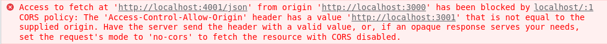
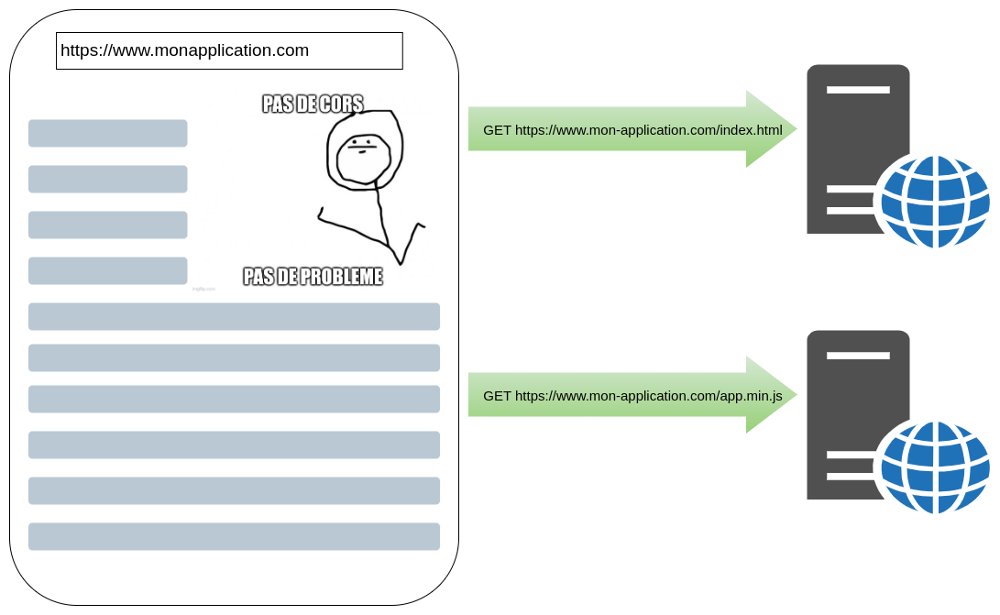
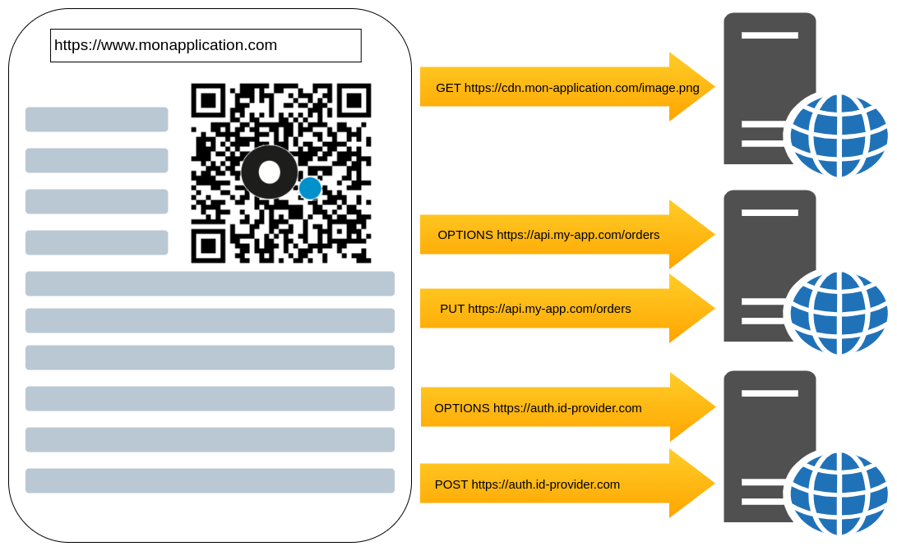
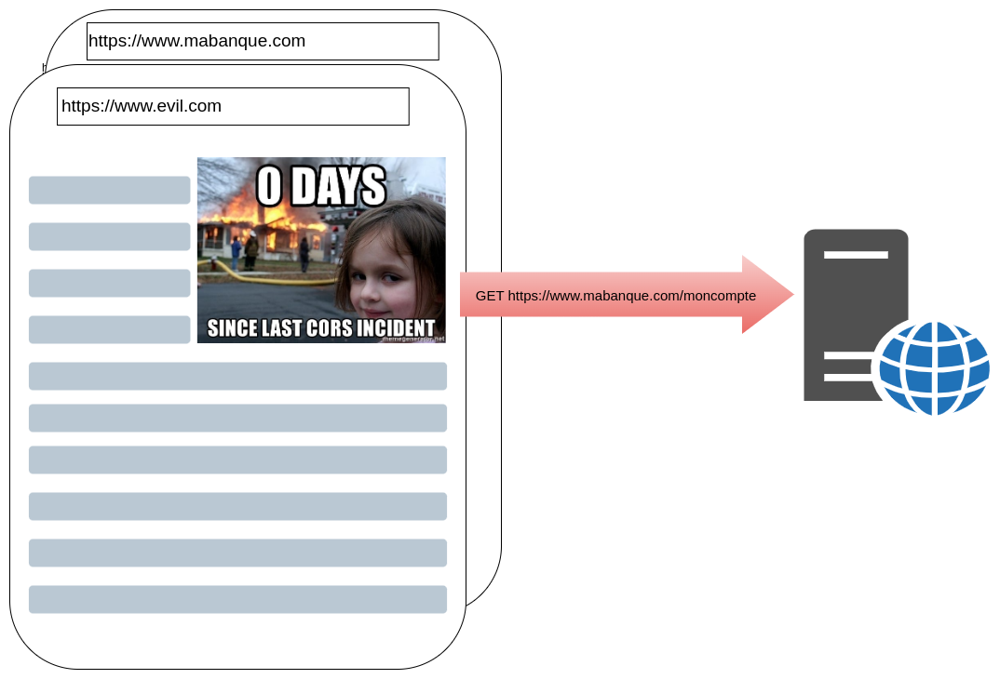

[.columns]
== Qui suis-je ?

// image de moi
[.column.is-half.profile]
image::pictures/moi.png[]

[.column.has-text-left]
--

Tech Lead/Archi technique
--

= Les erreurs CORS ?

== !

]

[NOTE.speaker]
--
Pas celles là

--

== !

[.screenshot]

[NOTE.speaker]
--
Celles là

--

== Et ça consiste en quoi ?
// animation ?
// les étapes suivantes, mais en schémas

[.columns.profile]

[NOTE.speaker]
--

pas de cors parce qu'on est sur le même domaine !

--

== CORS Triggered

[.columns.profile]

[NOTE.speaker]
--

2 types d'appels cors

sans options et avec options

* `www.monapplication.com/index.html` => Same-Site
* `www.monapplication.com/app.min.js` => Same-Site
* `api.monapplication.com/compute` => CORS
* `auth.monapplication.com/login` => CORS
* `cdn.monapplication.com/logo.png` => CORS

* C'est une extension du protocole HTTP
* Spécifie un ensemble d'entêtes spécifiques
** Origin
** Access-Control-Allow-Origin
** Access-Control-Allow-Methods
** Access-Control-Allow-Headers
* La responsabilité de configurer les entête CORS revient aux serveurs appelés
* Les navigateurs lèvent des alertes de sécurité si les entêtes ne sont pas positionnés correctement
* Les navigateurs refusent de charger les ressources externes dont les entêtes ne sont pas corrects

Il y a d'autres headers voir la doc

--

== Evil.com

[NOTE.speaker]
--

Phishing
Un site malveillant fait une requête sur gmail, si je suis loggé sur gmail
sans CORS dans le navigateur, la page du site malveillant pourrait récupérer mes cookies

les entêtes étant dans la réponse, le serveur travaille quand même

* Protéger les utilisateurs d'attaques de type "phishing"
* Contrôler que le client et le serveur peuvent discuter
* Protéger son service d'appels depuis des pages non autorisées

--

